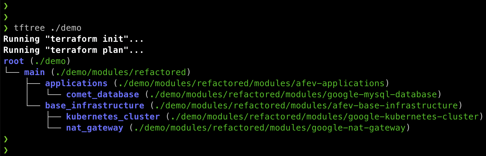

# Terraform tree

Display your Terraform module call stack as a tree in your terminal.



## Installation

With Homebrew:

```bash
brew install busser/tap/tftree
```

From source:

```bash
make build # then move bin/tftree into your PATH
```

## Usage

In any directory where you would run `terraform plan`:

```bash
tftree
```

You can also run `tftree` in a specific directory:

```bash
tftree ./production
```

To disable output formatting (colors, bold text, etc.):

```bash
tftree -no-color
```

## License

The code is licensed under the permissive Apache v2.0 license. [Read this](<https://tldrlegal.com/license/apache-license-2.0-(apache-2.0)>) for a summary.
